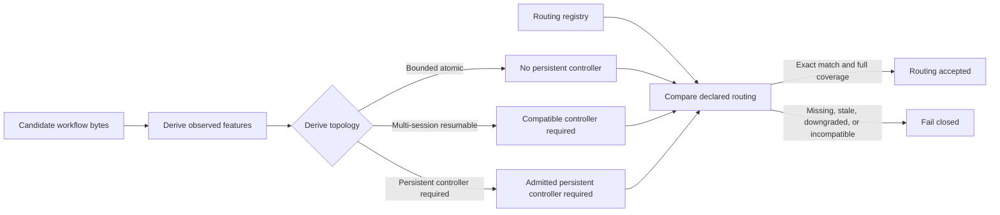
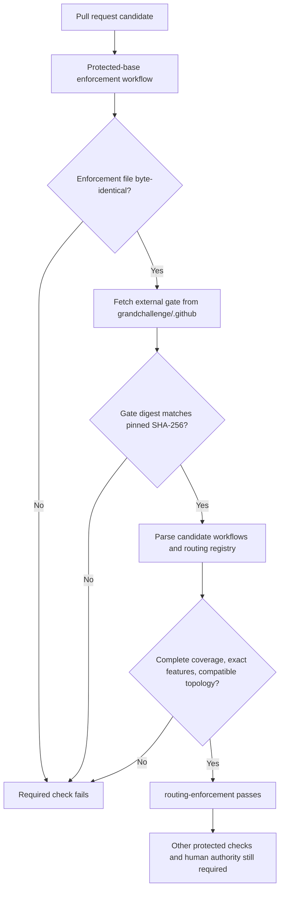

# GH-OS execution routing guide

This guide explains the mandatory execution-routing control implemented for the
protected `grandchallenge/gcl-standards` workflow surface. It is descriptive
operator guidance. The validator, protected workflow, repository ruleset, and
external policy gate remain the mechanical controls.

## What the control guarantees

Every direct GitHub Actions workflow in `.github/workflows/` must appear exactly
once in `.ghos-routing/workflows.json`. The validator derives safety-relevant
features from the workflow bytes and derives the required execution topology.
The registry cannot downgrade either result.

Any workflow that requires autonomous wake, opaque execution, credentials,
write capability, or a non-reconcilable mutation requires an admitted
persistent controller. A workflow that cannot satisfy that requirement must be
rewritten as bounded, independently resumable transactions before admission.

The current admitted controller is repository-bound GitHub Actions. Its durable
wake and run/job state are external to conversational context. Controller
capability never grants merge, constitutional, certification, production,
publication, mathematical-claim, claim-promotion, or commercial authority.

## Why a candidate cannot route around the gate

The required check runs from `pull_request_target`, using the protected base's
enforcement workflow. It treats the pull-request head as untrusted input and
does not execute candidate code.

The protected branch ruleset independently requires `routing-enforcement`, is
strict, and has no bypass actors. Candidate removal of local validation,
candidate repinning of a reusable policy caller, or addition of an unregistered
workflow therefore cannot satisfy the protected merge gate.

## Classification rules

The validator derives topology conservatively:

| Observed workflow property | Derived feature | Minimum topology |
| --- | --- | --- |
| `schedule` | `SCHEDULED`, `AUTONOMOUS_WAKE` | `PERSISTENT_CONTROLLER_REQUIRED` |
| `repository_dispatch` or `workflow_run` | `UNATTENDED_DISPATCH`, `AUTONOMOUS_WAKE` | `PERSISTENT_CONTROLLER_REQUIRED` |
| Any action or command step | `OPAQUE_EXECUTION` | `PERSISTENT_CONTROLLER_REQUIRED` |
| Secret or `github.token` use | `SECRET_CREDENTIAL` | `PERSISTENT_CONTROLLER_REQUIRED` |
| Write permissions or recognized mutation command | `WRITE_CAPABLE` | `PERSISTENT_CONTROLLER_REQUIRED` |
| Explicit non-reconcilable mutation marker | `NON_RECONCILABLE_MUTATION` | `PERSISTENT_CONTROLLER_REQUIRED` |
| External reusable job, external wait, or unattended dispatch without a stronger feature | Corresponding feature | `MULTI_SESSION_RESUMABLE` |
| None of the above | None | `BOUNDED_ATOMIC` |

Because action and command internals may be opaque to the validator, their
classification is intentionally conservative. A registry entry is a checked
description, not a waiver.

## Changing or adding a workflow

1. Change the workflow bytes.
2. Run the routing validator to obtain any feature-drift or coverage failure.
3. Add or update exactly one entry in `.ghos-routing/workflows.json` using the
   derived feature list and topology.
4. If the topology is not `BOUNDED_ATOMIC`, use the exact admitted controller
   and verify that it supports every derived feature. Otherwise, decompose the
   workflow until each resulting workflow is independently bounded and
   register every resulting file.
5. Run `python ci/validate.py` and
   `python -m unittest discover -s tests -p "test_*.py"`.
6. Open an ordinary pull request. Do not modify
   `.github/workflows/ghos-routing-enforcement.yml` in the same candidate; the
   protected-base check rejects self-modification.
7. Require the exact-head `routing-enforcement` result along with every other
   protected check and applicable review or human authorization.

The validator prints the precise missing paths, stale paths, feature drift, or
controller mismatch. Correct the workflow or its routing record; do not add
prose asserting that decomposition occurred.

## Failure interpretation

- **Coverage mismatch:** a workflow is unregistered or a registry entry names a
  file that no longer exists.
- **Feature declaration drift:** the workflow bytes changed but the registered
  observed features did not.
- **Topology declaration drift:** the registry attempts to use a weaker or
  otherwise different topology than the derived result.
- **Controller mismatch:** the controller is absent, not admitted, or lacks a
  required feature capability.
- **Repository identity mismatch:** the registry is being reused in a different
  repository.
- **Enforcement self-modification:** the candidate changed or removed the
  protected-base enforcement workflow.
- **External gate digest failure:** the shared gate bytes no longer match the
  independently pinned digest; execution stops before candidate evaluation.

## Proven hostile case

The acceptance pull request `grandchallenge/gcl-standards#69` removed
candidate-local validation, repinned the reusable policy caller to a pre-gate
revision, and added an unregistered scheduled write workflow. The ordinary
reusable policy check passed, while the independently required
`routing-enforcement` check failed and blocked integration. The pull request was
closed without merge.

This demonstrates the intended boundary: candidate-controlled checks are useful
evidence, but the mandatory routing decision is made outside candidate control.

## Scope and authority boundary

This implementation covers the protected `gcl-standards` workflow surface. It
does not by itself install equivalent rulesets or enforcement workflows in
other repositories and must not be described as organization-wide coverage.
It does not approve, merge, ratify, certify, activate, publish, promote, or
authorize claims.

